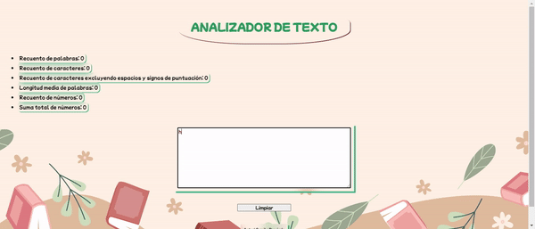

# Aplicación Web de Análisis de Texto

Esta es una sencilla aplicación web que te permite ingresar un texto en un cuadro de texto y calcular varias métricas en tiempo real. A medida que escribes, la aplicación actualizará automáticamente los resultados. Además, puedes limpiar el contenido del cuadro de texto con un botón.

## Funcionalidades

La aplicación realiza las siguientes métricas en el texto de entrada:

1. **Recuento de Palabras:** Calcula el número de palabras en el texto ingresado y muestra el recuento en tiempo real.

2. **Recuento de Caracteres:** Calcula el número total de caracteres en el texto, incluyendo espacios y signos de puntuación, y muestra el recuento en tiempo real.

3. **Recuento de Caracteres Excluyendo Espacios y Signos de Puntuación:** Calcula el número de caracteres en el texto, excluyendo espacios y signos de puntuación, y muestra el recuento en tiempo real.

4. **Recuento de Números:** Cuenta cuántos números válidos hay en el texto y muestra el recuento en tiempo real.

5. **Suma Total de Números:** Suma todos los números válidos presentes en el texto y muestra el resultado en tiempo real.

6. **Longitud Media de las Palabras:** Calcula la longitud promedio de las palabras en el texto y muestra el resultado en tiempo real.

7. **Limpieza de Contenido:** Permite limpiar el contenido del cuadro de texto con un botón.

## Cómo Usar

1. Ingresa o pega tu texto en el cuadro de texto.

2. Observa cómo los resultados se actualizan automáticamente a medida que escribes.

3. Utiliza el botón "Limpiar" para eliminar todo el contenido del cuadro de texto.

¡Disfruta analizando tu texto y obteniendo métricas útiles en tiempo real con esta aplicación web!

## Tecnologías Utilizadas

Esta aplicación web ha sido desarrollada utilizando las siguientes tecnologías:

- HTML
- CSS
- JavaScript

## Contribución

Si deseas contribuir o realizar mejoras en esta aplicación web, no dudes en hacer un fork del repositorio y enviar tus propias contribuciones. ¡Estamos abiertos a sugerencias y colaboraciones!

**Nota:** Esta es una aplicación de ejemplo y se recomienda utilizarla con fines educativos y de aprendizaje.
